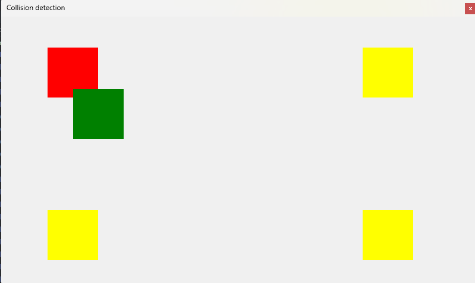

# Vaje Programiranje 3 (18.4.2023)
## Pripravil: Gregor Kuhelj

### Naloga:

Naredi grafični vmesnik, ki bo vseboval 5 pictureboxov. Na sredini naj bo en kvadrat zelene barve, zraven pa naj bodo še 4 rumeni kvadrati (kot kaže spodnja slika). Zelenemu kvadratu omogoči premikanje s tipkami Levo, Desno, Gor, Dol. Ob stiku zelenega in rumenega kvadrata, naj se rumeni kvadrat obarva v rdečo barvo.

Skica programa pred trkom:

Skica programa ob trku:

